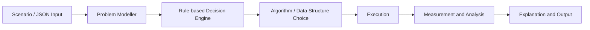

# Agentic_framework

Autonomous DAA Decision Framework is a Python-based project that reads real-world scenario descriptions, recognizes the matching design-and-analysis-of-algorithms problem, selects the correct data structure or algorithm, executes it, and explains the reasoning, complexity, and trade-offs.

This project builds a single framework that reads a real-world scenario, recognizes which DAA problem it matches, chooses a suitable algorithm or data structure, runs it, and explains the decision.

## Roadmap

1. Start from scenario semantics: entities, constraints, objective, and size parameters.
2. Extract decision features such as density, divisibility, disk vs memory, decrease-key ratio, and graph structure.
3. Match these features to a DAA problem using rule-based logic.
4. Execute the selected algorithm and compare with a relevant alternative.
5. Measure runtime, memory, and operation counts.
6. Present the result in a report with complexity, correctness, and NP-hardness notes.

## Architecture



## Example scenarios included

- MST dense graph: Prim vs Kruskal
- Knapsack with divisible vs indivisible items
- TSP route optimization
- N-queens sensor placement
- Hamiltonian cycle validation

## Quick start

```bash
cd e:\DAAassign
py -m pytest -q
py -m daa_framework.framework scenarios\mst_dense.json
```

## Folder structure

```text
DAAassign/
├── daa_framework/
│   ├── __init__.py
│   └── framework.py
├── scenarios/
│   ├── mst_dense.json
│   ├── knapsack_fractional.json
│   ├── tsp.json
│   └── nqueens.json
├── tests/
│   └── test_framework.py
├── README.md
├── report.md
└── .gitignore
```

## Notes

- The framework is intentionally rule-based and deterministic.
- It follows the assignment brief by distinguishing decision and optimization versions and focusing on exact, pseudo-polynomial, and NP-hard classifications.
