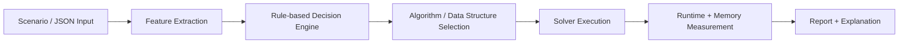

# Agentic DAA Decision Framework

This project reads a scenario, identifies the matching design-and-analysis-of-algorithms problem, selects a suitable algorithm or data structure, runs it, and explains the decision and complexity trade-offs.

## End-to-end example

A dense MST scenario such as a graph with 4 vertices and 6 weighted edges is read as JSON, recognised as an MST problem, and the framework selects Prim because the density exceeds the 0.4 threshold. It then executes the algorithm and reports the cost and chosen edges.

```json
{
  "kind": "mst",
  "graph_density": 0.9,
  "graph": {
    "vertices": ["A", "B", "C", "D"],
    "edges": [["A", "B", 1], ["A", "C", 2], ["B", "C", 3], ["B", "D", 4], ["C", "D", 5], ["A", "D", 6]]
  }
}
```

The live output includes a detected decision of `prim` with a total cost of `7` and selected edges `[('A', 'B', 1), ('A', 'C', 2), ('B', 'D', 4)]`.

## Architecture



## Decision rules and thresholds

- Dense MST: if graph_density >= 0.4, prefer Prim; otherwise prefer Kruskal.
- Disk-backed ordered data: choose B-Tree; in-memory ordered data: Red-Black Tree.
- Priority queue workloads: higher decrease-key ratio chooses Fibonacci Heap; merge-heavy workloads choose Binomial Heap.
- Divisible items: if items_divisible is true, choose Fractional Knapsack; otherwise use 0/1 Knapsack.
- All-pairs shortest path: if all_pairs_needed is true, choose Floyd-Warshall.
- Exact tour optimization: use TSP branch-and-bound for complete tours.
- Feasibility or placement constraints: use backtracking for Hamiltonian cycle and N-Queens.

## Example structured output

```json
{
  "status": "ok",
  "decision": {
    "problem": "fractional_knapsack",
    "algorithm": "fractional_knapsack",
    "rule_id": "RULE_KNAPSACK_FRACTIONAL"
  },
  "result": {
    "total_value": 220.0,
    "total_weight": 50.0,
    "chosen": [
      {"name": "B", "fraction": 1.0, "weight": 20, "value": 100.0},
      {"name": "C", "fraction": 1.0, "weight": 30, "value": 120.0}
    ]
  }
}
```

## Benchmark snapshot

| Case | Problem | Algorithm | Runtime (s) | Peak memory (bytes) |
| --- | --- | --- | ---: | ---: |
| dense_mst | mst | prim | 0.000062 | 2320 |
| sparse_mst | mst | kruskal | 0.000018 | 560 |
| tsp_10 | tsp | branch_and_bound | 0.119559 | 12704 |
| n_queens_10 | n_queens | backtracking | 0.138059 | 101744 |
| zero_one_knapsack | zero_one_knapsack | zero_one_knapsack | 0.000126 | 4552 |
| fractional_knapsack | fractional_knapsack | fractional_knapsack | 0.000038 | 400 |

This table includes a clear example of the framework switching algorithms when the feature changes: dense MST chooses Prim while sparse MST chooses Kruskal.

## Quick start

```bash
cd e:\DAAassign
py -m pytest -q
py -m daa_framework.framework scenarios\mst_dense.json
py -c "from daa_framework.framework import benchmark_table; print(benchmark_table())"
```

To regenerate the report file:

```bash
py -c "from daa_framework.framework import build_report; open('report.md', 'w', encoding='utf-8').write(build_report())"
```

## Folder structure

```text
DAAassign/
├── daa_framework/
│   ├── __init__.py
│   └── framework.py
├── scenarios/
│   ├── mst_dense.json
│   ├── knapsack_fractional.json
│   ├── tsp.json
│   └── nqueens.json
├── tests/
│   └── test_framework.py
├── README.md
├── report.md
├── .gitignore
└── .pytest_cache/
```

## Notes

- The framework is intentionally rule-based and deterministic.
- It distinguishes optimization and decision versions and keeps polynomial, pseudo-polynomial, NP-Hard, and NP-Complete labels explicit.
- It is designed for clear teaching examples and small-to-medium exact instances, not for a general-purpose black-box optimizer.
