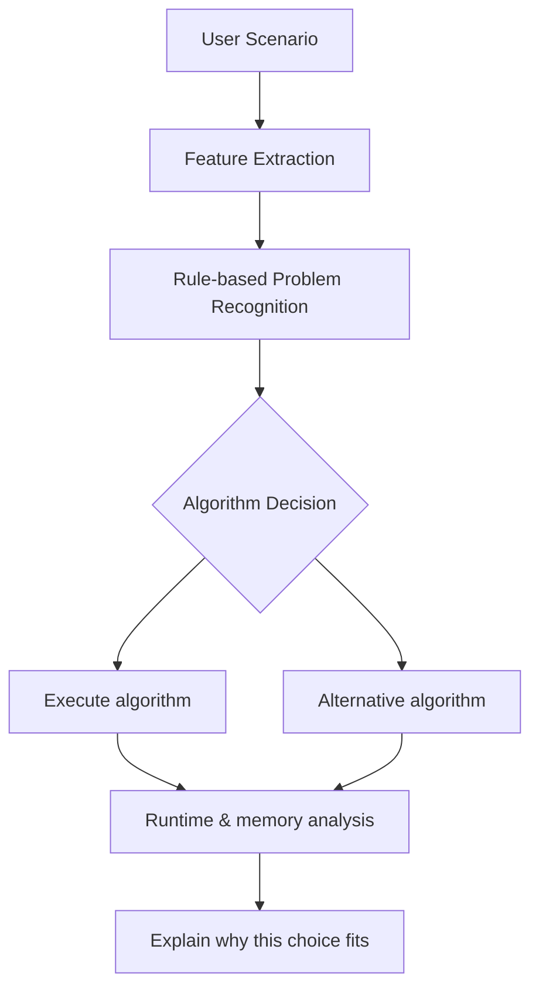

# DAA Framework Report

## 1. Scenario-to-problem mapping

The framework starts from a real scenario and maps entities to graph, selection, ordering, or optimization problems. The problem model is used to decide among the permitted DAA syllabus topics: B-tree, Red-Black Tree, Binomial Heap, Fibonacci Heap, MST algorithms, Fractional Knapsack, 0/1 Knapsack, Floyd-Warshall, Matrix Chain Multiplication, Hamiltonian cycle, N-Queen style placement, TSP, and complexity classification.

## 2. Architecture diagram

## 3. Key decisions supported

- Ordered searchable data: choose B-Tree for disk workloads and Red-Black Tree for in-memory workloads.
- Merge-heavy priority queues: choose Binomial Heap; many decrease-key operations point to Fibonacci Heap.
- MST: use Prim for dense graphs and Kruskal for sparse or edge-list inputs.
- All-pairs costs: choose Floyd-Warshall for dense small graphs.
- Knapsack: Fractional when divisible, 0/1 when indivisible.
- Matrix chain: choose dynamic programming when matrix dimensions determine an optimal parenthesization.
- Hamiltonian, N-Queen, TSP: use backtracking and branch-and-bound for exact small instances.

## 4. Complexity notes

- Fractional Knapsack is polynomial.
- 0/1 Knapsack is pseudo-polynomial in capacity W; its decision version is NP-Complete.
- TSP optimization is NP-Hard; its decision version is NP-Complete.
- Hamiltonian cycle decision is NP-Complete.
- N-Queen is not automatically labeled NP-Complete in the standard formulation.

## 5. Behaviour changes

The framework can flip its choice when scenario conditions change:

- Dense graph vs sparse graph changes Prim vs Kruskal.
- Divisible vs indivisible items changes greedy vs dynamic programming.
- Frequent decrease-key vs frequent merges changes Fibonacci vs Binomial Heap.

## 6. Validation approach

The code validates multiple normal, boundary, and difficult tests. The project includes a pytest suite covering detection logic, execution, and scenario file handling.
