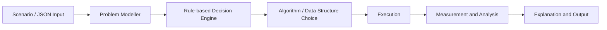
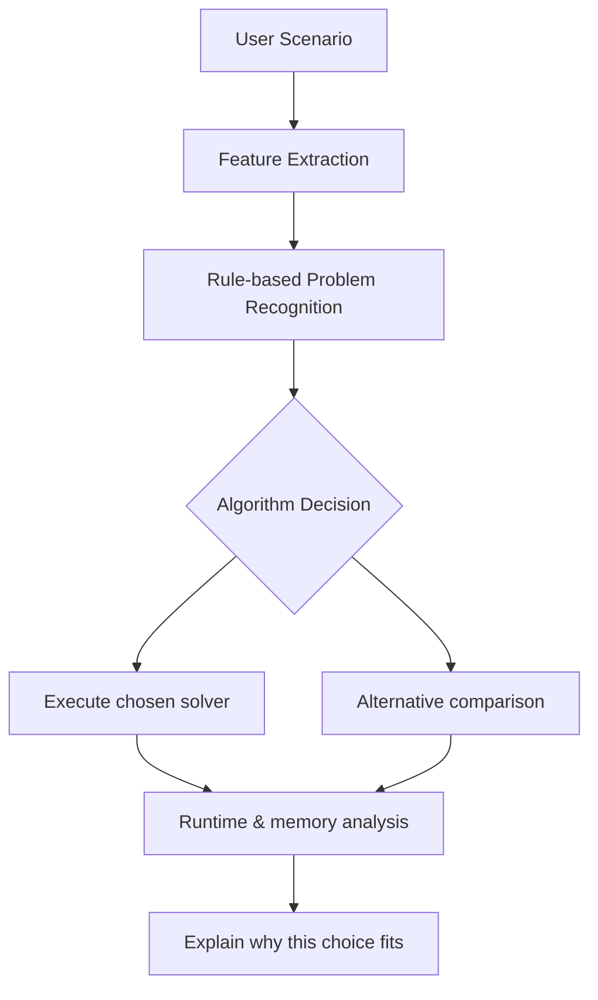

# DAA Framework Report

## 1. Scenario-to-problem mapping

The framework starts from a real scenario and maps entities to graph, ordering, optimization, or feasibility problems. It identifies candidate DAA topics including MST, heap variants, ordering structures, knapsack forms, Floyd-Warshall, matrix-chain, Hamiltonian cycle, N-Queens, and TSP, before selecting a suitable exact algorithm.

## 2. Architecture diagram



The diagram is intentionally prominent because the design is built around a complete pipeline: input arrives, the framework infers the structure, picks a solver, executes it, measures runtime/memory, and finally explains the choice.

## 3. End-to-end example

A dense MST scenario is a good demonstration of the full workflow. The scenario below is parsed, the graph density is measured, the problem is detected as MST, and the framework chooses Prim because the graph is dense.

```json
{
  "kind": "mst",
  "graph_density": 0.9,
  "graph": {
    "vertices": ["A", "B", "C", "D"],
    "edges": [["A", "B", 1], ["A", "C", 2], ["B", "C", 3], ["B", "D", 4], ["C", "D", 5], ["A", "D", 6]]
  }
}
```

The live output reports a decision of `prim` with total cost `7` and selected edges `[('A','B',1), ('A','C',2), ('B','D',4)]`, which confirms the framework not only classifies the problem but also executes a valid solver.

## 4. Key decisions supported



## 5. Key decisions supported

- Ordered searchable data: B-Tree for disk workloads and Red-Black Tree for in-memory workloads.
- Merge-heavy priority queues: Binomial Heap; frequent decrease-key operations: Fibonacci Heap.
- MST: Prim for dense graphs and Kruskal for sparse or edge-list inputs.
- All-pairs shortest path: Floyd-Warshall for dense small graphs.
- Knapsack: Fractional when divisible, 0/1 when indivisible.
- Matrix chain: dynamic programming for optimal parenthesization.
- Hamiltonian, N-Queens, TSP: backtracking and branch-and-bound for exact small instances.

## 6. Complexity notes

- MST: polynomial; Kruskal is O(E log V), dense Prim is O(V^2) with matrix adjacency.
- Fractional Knapsack: polynomial, greedy by value/weight.
- 0/1 Knapsack: pseudo-polynomial in capacity W; decision version is NP-Complete.
- TSP optimization: NP-Hard; decision version is NP-Complete.
- Hamiltonian cycle: NP-Complete decision problem.
- N-Queens: exponential worst-case search tree; usually treated as a constraint-satisfaction problem, not a standard NP-hard optimization formulation.
- Floyd-Warshall: polynomial, Θ(V^3).
- Matrix chain: polynomial dynamic-programming solution.

## 7. Behaviour changes

The framework can flip its choice when scenario conditions change:

- Dense graph vs sparse graph changes Prim vs Kruskal.
- Divisible vs indivisible items changes greedy vs dynamic programming.
- Frequent decrease-key vs frequent merge operations changes Fibonacci vs Binomial Heap.
- Larger n values increase the search space of exact solvers such as TSP and N-Queens.

## 8. Benchmark snapshot

The following benchmark table was generated by the framework on representative scenarios.

| Case | Problem | Algorithm | Runtime (s) | Peak memory (bytes) |
| --- | --- | --- | ---: | ---: |
| dense_mst | mst | prim | 0.000062 | 2320 |
| sparse_mst | mst | kruskal | 0.000018 | 560 |
| tsp_10 | tsp | branch_and_bound | 0.119559 | 12704 |
| n_queens_10 | n_queens | backtracking | 0.138059 | 101744 |
| zero_one_knapsack | zero_one_knapsack | zero_one_knapsack | 0.000126 | 4552 |
| fractional_knapsack | fractional_knapsack | fractional_knapsack | 0.000038 | 400 |

This shows a clear algorithm switch: the dense MST case chooses Prim while the sparse MST case chooses Kruskal, even though the underlying problem remains the same minimum spanning tree objective.

## 9. Validation approach

The project includes a pytest suite covering detection logic, execution, benchmark generation, and scenario-file handling. The current suite confirms that the main decision rules and solver calls behave as expected.
